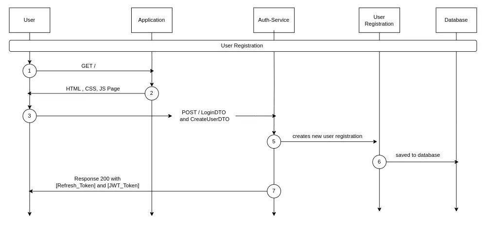

# Auth Service

## Overview

Many organizations are transitioning to use FusionAuth instead of OAuth 2.0 due to its extensive range of services beyond standard OAuth 2.0 functionalities. Key services provided by FusionAuth include:

### Comprehensive IAM Platform

- **Authentication**: Password-based authentication, social login (e.g., Google, Facebook), Single Sign-On (SSO)
- **Authorization**: Role-based access control (RBAC)
- **User Management**:
  - User registration and profile management
  - Password recovery and account management

...and many more.

## What Does This Auth Service Do

This auth service is essentially a lightweight version of FusionAuth, providing essential functionalities such as:

- **Authentication**
- **Authorization**
- **User Management**
- **Application Management**
- **Memory Management**

## Issues Resolved by This Auth Service

- This auth service addresses memory management issues, effectively managing resources even when registering a large number of users (e.g., using 117 MB for registering 100 users).

## Key Features

- **Key APIs**: Used to manage cryptographic keys for authentication. For more details, refer to the [Key-API documentation](key-api-readme.md).

- **Refresh Tokens APIs**: Used to perform CRUD operations on access tokens and JWT. For more details, refer to the [Refresh Token documentation](refreshToken.md).

- **Groups APIs**: Used to organize users into groups. For more details, refer to the [Group APIs documentation](Group.md) and to [Group Diagram](https://drive.google.com/file/d/185s3XVx5HdGO2ItTXmZDDBVj3CIylVhI/view?usp=sharing)

- **Tenants**: Named objects representing discrete namespaces for Users, Applications, and Groups. For more details, refer to the [Tenant documentation](Tenants.md).
- **Users** : Used to manage features provided regarding Users. For more details, refer to [User docs](User.md) and to [User Diagram](https://drive.google.com/file/d/1xXhFhM5WwMYZE9QaD47STtHsJcOsNliO/view?usp=sharing).

- **Application** : Used to manage application CRUD operations. For more details, refer to [Application docs](Application.md) and to [Application diagrams](https://drive.google.com/file/d/1xnLQehVQc22FkDvubRN7tJR0fOQUdYKI/view?usp=sharing).

- **OTP** : Used to perform authentication using OTP. For more details, refer to [OTP docs](OTP.md)

## Flow Diagrams of APIs 


`Application Diagram`


`User Diagram`



`Group Diagram`


## Application and Significance

- Comprehensive user management
- Efficient memory utilization
- Streamlined authentication and authorization processes
- Simplified application management

This service is designed to offer a balance of necessary features from FusionAuth while ensuring efficient resource management, making it suitable for applications with focused user and application management needs.

## Schema of Service 
The proposed schema which will act as skeleton for the service.

### application_oauth_scopes
`applications_id` - application to which the scope belong
`name` - name of the scope

### application_roles
`applications_id` - 
`description` - 
`is_default` - whether the role is default or not
`is_super_role` - whether it is admin role
`name` - name of the role
`description` - about the role
`application_oauth_scopes_id` - the scopes allowed to a particular role

### applications
`active` - in service or not
`data` - configurations of application
`name` - name of application
`tenants_id` - tenant it is using
`templates_link_json` - contains the link of various templates in json format

### tenants
`access_token_signing_keys_id` - id of key used to sign the access tokens
`id_token_signing_keys_id` - id of key used to sign identity tokens
`name` - name of tenant
`data` - configurations and extra settings of tenant

### user_registration
`applications_id` - application id
`authentication_token` - the token created while authenticating the user
`data` - stores tokens and preferred languages

### users
`tenants_id` - tenant to which it belongs to
`groups_id` - groups to which it belongs to

### keys / jwks
`algorithm` - algo used
`certificate` - certificate of key
`issuer` - the issuer(we) of key
`kid`
`private_key`
`public_key`
`secret`

### groups
`tenants_id` - tenant it is using

### group_members
`users_id` - id of user
`groups_id` - id of group to which the particular user belongs to

## group_application_roles
`application_roles_id` - the role which is placed in a group
`groups_id` - the group to which a particular role belongs to

## REQUIRED -
 1. `application_oauth-scopes`, 
 2. `application roles`, 
 3. `applications [active,data/config, name, tenants_id, templates_link_json]`,
 4. ` authentication_keys`,
 5.  `groups / roles` (id,permissions,name) and `users` will have an optional group field, can handle permissions for both users and organizations(entities), and tenants/settings in a setting attribute containing(id_token_sign_key, access_token_sign_key)
 6.  `user` (expiry,data -> json,groupid->array)
 7.  `refresh_tokens`
 8.  `keys`
 9.  
   
### Notes


## NOT REQUIRED - 
application_daily/monthly_active_users, audit logs (we will be using telemetry logs)
1. `identities`
## RESEARCH REQUIRED - 
1. `families`
  these are focussed more on familial relationships like parent and child. Inclued management features like parental controls. Unlike groups emphazise roles and permissions allowing buld assignment of access rights and roles to users.
2. `entity_entity_grant`
3. `form_fields`
    used with `forms` and `form_steps` to create a custom form field for taking inputs. `forms` are customizable objects that consists of many `form_steps` which in turn contains `form_fields`
4. `entity_type_permissions`
5. `connectors`
    just like identity providers they can be used to connect fusionauth to an external system of record for user identity.
6. `user_actions`
   User Actions in FusionAuth are ways to interact with, reward, and discipline users. For example, you could use them to email a user, call another application when a user does something, or temporarily disable a user’s login.
7. `consents`
    Consent is a definition of a permission that can be given to a User. Can't find the difference b/w this and grants`


## Resources 
- [Intro to oidc-provider](https://www.scottbrady91.com/openid-connect/getting-started-with-oidc-provider) is the basic stepping stone to practically understand oidc

- [Fusion Auth full Schema](https://dbdiagram.io/d/66588635b65d9338791a13ab) is the actual db schema of fusionauth

- [Schema from fusion auth ui](https://fusionauth.io/docs/get-started/core-concepts/users) the schema from Fusionauth UI.

- [Fusion Auth tokens](https://fusionauth.io/docs/lifecycle/authenticate-users/oauth/tokens#client-credentials-access-token) read about tokens on fusionauth here.

- [OAuth login flow using authorization code](https://fusionauth.io/articles/login-authentication-workflows/webapp/oauth-authorization-code-grant-jwts-refresh-tokens-cookies) shows  how the authorization flow will look like

- [Advance OIDC ](https://connect2id.com/learn/openid-connect#token-endpoint)

### A configuration example for a client
```
{
  "jwtConfiguration": {
    "enabled": true,
    "timeToLiveInSeconds": 60,
    "refreshTokenExpirationPolicy": "SlidingWindow",
    "refreshTokenTimeToLiveInMinutes": 60,
    "refreshTokenUsagePolicy": "OneTimeUse"
  },
  "registrationConfiguration": {
    "type": "basic"
  },
  "oauthConfiguration": {
    "authorizedRedirectURLs": [
      "/admin/login"
    ],
    "clientId": "3c219e58-ed0e-4b18-ad48-f4f92793ae32",
    "clientSecret": "NTdlMGE5OTkwNWJlODA4ZjkyY2M0NjM4ZjhkYzUzMTIxZDRiMGQ2Y2VjZGVhMjQzZTBmZjIyZjUzNzg5YzhiZg==",
    "enabledGrants": [
      "authorization_code",
      "refresh_token"
    ],
    "logoutURL": "/admin/single-logout",
    "generateRefreshTokens": true,
    "clientAuthenticationPolicy": "Required",
    "proofKeyForCodeExchangePolicy": "Required"
  },
  "loginConfiguration": {
    "allowTokenRefresh": false,
    "generateRefreshTokens": false,
    "requireAuthentication": true
  },
  "unverified": {
    "behavior": "Allow"
  },
  "verificationStrategy": "ClickableLink",
  "state": "Active"
}
```


## FusionAuth and Hasura setup
This documentation will help you setup fusionauth and hasura in your own development environment to get accustomed to.

**docker-compose.yml**
```
version: '3'

services:
  db:
    image: postgres:16.0-bookworm
    environment:
      PGDATA: /var/lib/postgresql/data/pgdata
      POSTGRES_USER: ${POSTGRES_USER}
      POSTGRES_PASSWORD: ${POSTGRES_PASSWORD}
    healthcheck:
      test: [ "CMD-SHELL", "pg_isready -U postgres" ]
      interval: 5s
      timeout: 5s
      retries: 5
    networks:
      - db_net
    restart: always
    volumes:
      - db_data:/var/lib/postgresql/data
    ports:
      - 5432:5432

  search:
    image: opensearchproject/opensearch:2.11.0
    environment:
      cluster.name: fusionauth
      discovery.type: single-node
      node.name: search
      plugins.security.disabled: true
      bootstrap.memory_lock: true
      OPENSEARCH_JAVA_OPTS: ${OPENSEARCH_JAVA_OPTS}
    healthcheck:
      interval: 10s
      retries: 80
      test: curl --write-out 'HTTP %{http_code}' --fail --silent --output /dev/null http://localhost:9200/
    restart: unless-stopped
    ulimits:
      memlock:
        soft: -1
        hard: -1
      nofile:
        soft: 65536
        hard: 65536
    ports:
      - 9200:9200 # REST API
      - 9600:9600 # Performance Analyzer
    volumes:
      - search_data:/usr/share/opensearch/data
    networks:
      - search_net

  fusionauth:
    image: fusionauth/fusionauth-app:latest
    depends_on:
      db:
        condition: service_healthy
      search:
        condition: service_healthy
    environment:
      DATABASE_URL: jdbc:postgresql://db:5432/fusionauth
      DATABASE_ROOT_USERNAME: ${POSTGRES_USER}
      DATABASE_ROOT_PASSWORD: ${POSTGRES_PASSWORD}
      DATABASE_USERNAME: ${DATABASE_USERNAME}
      DATABASE_PASSWORD: ${DATABASE_PASSWORD}
      FUSIONAUTH_APP_MEMORY: ${FUSIONAUTH_APP_MEMORY}
      FUSIONAUTH_APP_RUNTIME_MODE: ${FUSIONAUTH_APP_RUNTIME_MODE}
      FUSIONAUTH_APP_URL: http://fusionauth:9011
      SEARCH_SERVERS: http://search:9200
      SEARCH_TYPE: elasticsearch
    healthcheck:
      test: curl --silent --fail http://localhost:9011/api/status -o /dev/null -w "%{http_code}"
      interval: 5s
      timeout: 5s
      retries: 5
    networks:
      - db_net
      - search_net
    restart: unless-stopped
    ports:
      - 9011:9011
    volumes:
      - fusionauth_config:/usr/local/fusionauth/config
    
  graphql-engine:
    image: hasura/graphql-engine:v2.38.0
    ports:
      - "8080:8080"
    restart: always
    environment:
      ## postgres database to store Hasura metadata
      HASURA_GRAPHQL_METADATA_DATABASE_URL: postgres://postgres:postgres@db:5432/postgres
      ## this env var can be used to add the above postgres database to Hasura as a data source. this can be removed/updated based on your needs
      PG_DATABASE_URL: postgres://postgres:postgres@db:5432/fusionauth
      ## enable the console served by server
      HASURA_GRAPHQL_ENABLE_CONSOLE: "true" # set to "false" to disable console
      ## enable debugging mode. It is recommended to disable this in production
      HASURA_GRAPHQL_DEV_MODE: "true"
      HASURA_GRAPHQL_ENABLED_LOG_TYPES: startup, http-log, webhook-log, websocket-log, query-log
      ## uncomment next line to run console offline (i.e load console assets from server instead of CDN)
      # HASURA_GRAPHQL_CONSOLE_ASSETS_DIR: /srv/console-assets
      ## uncomment next line to set an admin secret
      HASURA_GRAPHQL_ADMIN_SECRET: myadminsecretkey
      HASURA_GRAPHQL_METADATA_DEFAULTS: '{"backend_configs":{"dataconnector":{"athena":{"uri":"http://data-connector-agent:8081/api/v1/athena"},"mariadb":{"uri":"http://data-connector-agent:8081/api/v1/mariadb"},"mysql8":{"uri":"http://data-connector-agent:8081/api/v1/mysql"},"oracle":{"uri":"http://data-connector-agent:8081/api/v1/oracle"},"snowflake":{"uri":"http://data-connector-agent:8081/api/v1/snowflake"}}}}'
    depends_on:
      data-connector-agent:
        condition: service_healthy
    networks:
      - db_net
      - search_net
    
  data-connector-agent:
    image: hasura/graphql-data-connector:v2.38.0
    restart: always
    ports:
      - 8081:8081
    environment:
      QUARKUS_LOG_LEVEL: ERROR # FATAL, ERROR, WARN, INFO, DEBUG, TRACE
      ## https://quarkus.io/guides/opentelemetry#configuration-reference
      QUARKUS_OPENTELEMETRY_ENABLED: "false"
      ## QUARKUS_OPENTELEMETRY_TRACER_EXPORTER_OTLP_ENDPOINT: http://jaeger:4317
    healthcheck:
      test: ["CMD", "curl", "-f", "http://localhost:8081/api/v1/athena/health"]
      interval: 5s
      timeout: 10s
      retries: 5
      start_period: 5s

networks:
  db_net:
    driver: bridge
  search_net:
    driver: bridge

volumes:
  db_data:
  fusionauth_config:
  search_data:
```

Create the file with the given contents.
After creating the file
1. `docker compose up -d`
2. FusionAuth on `localhost:9011`
3. Hasura on `localhost:8080/console`
4. After you are done, do `docker compose down -v`