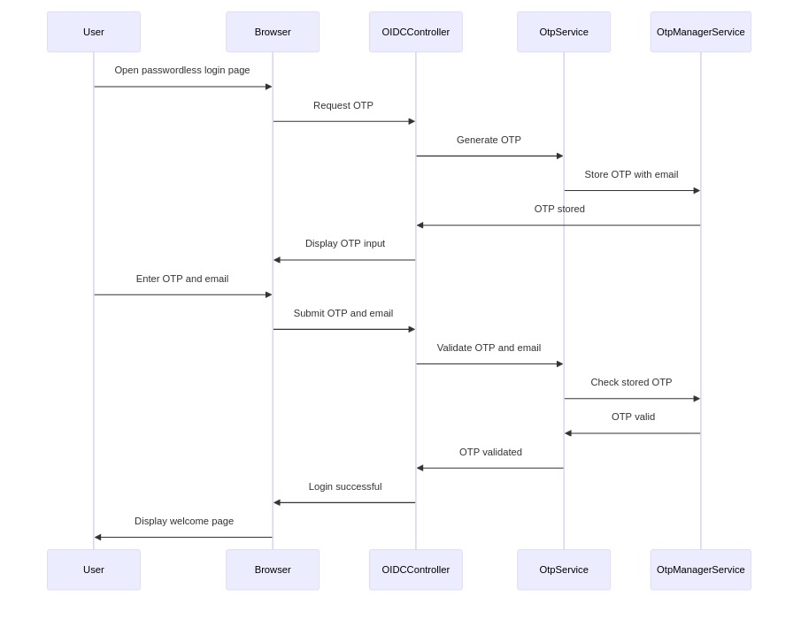

# OTP Service

The OTP (One-Time Password) Service is part of a NestJS application that handles the generation, sending, and validation of one-time passwords. It supports multiple delivery methods including email, SMS, and WhatsApp.

## Sequence Diagram



## Send OTP 
### Request
#### Generates and sends an OTP via specified channels.
`POST /otp/send`
- **Description** : Generates and sends an OTP via specified channels.
- **Parameters:**
    - `type`: string[] - An array of delivery methods ('mail', 'sms', 'whatsapp')
    - `to`: string - The recipient's address (email, phone number, etc.)
#### Request Parameters
- `type`: string[] - An array of delivery methods ('mail', 'sms', 'whatsapp')
- `to`: string - The recipient's address (email, phone number, etc.)

### Response

#### Response Codes

| Code | Description |
|------|-------------|
| 200  | The request was successful. The response will contain a JSON body. |
| 400  | The request was invalid and/or malformed. The response will contain an Errors JSON Object with the specific errors. This status will also be returned if a paid Auth Service license is required and is not present. |
| 401  | You did not supply a valid Authorization header. The header was omitted or your API key was not valid. The response will be empty
| 404  | The object you are trying to update doesn't exist. The response will be empty. |
| 500  | There was an internal error. A stack trace is provided and logged in the Auth Service log files. The response will be empty. |
  

- **Sample cURL**:
  ```sh
  curl -X POST http://localhost:3000/otp/send \
  -H "Content-Type: application/json" \
  -d '{
    "type": ["mail", "sms"],
    "to": "example@example.com"
  }'

- **Sample HTTPie**:
  ```sh
  http POST http://localhost:3000/otp/send \
  type:='["mail", "sms"]' \
  to="example@example.com"

## Validate OTP
### Request 
#### Validates a given OTP.
`POST /otp/verify`

#### Request Parameters
-   `otp`: string - The OTP to validate

### Response

#### Response Codes

| Code | Description |
|------|-------------|
| 200  | The request was successful. The response will contain a JSON body. |
| 400  | The request was invalid and/or malformed. The response will contain an Errors JSON Object with the specific errors. This status will also be returned if a paid Auth Service license is required and is not present. |
| 401  | You did not supply a valid Authorization header. The header was omitted or your API key was not valid. The response will be empty
| 404  | The object you are trying to update doesn't exist. The response will be empty. |
| 500  | There was an internal error. A stack trace is provided and logged in the Auth Service log files. The response will be empty. |
  

- **Sample cURL**:
  ```sh
  curl -X POST http://localhost:3000/otp/verify \
  -H "Content-Type: application/json" \
  -d '{
    "otp": "123456"
  }'

- **Sample HTTPie**:
  ```sh
  http POST http://localhost:3000/otp/verify \
  otp="123456"

## Response Format
All endpoints return a standardized response object containing:
- `success`: Boolean indicating operation success
- `message`: Descriptive message about the operation result

## Error Handling
The service includes comprehensive error handling, throwing appropriate HTTP exceptions for various scenarios such as unauthorized access, bad requests, or internal server errors.