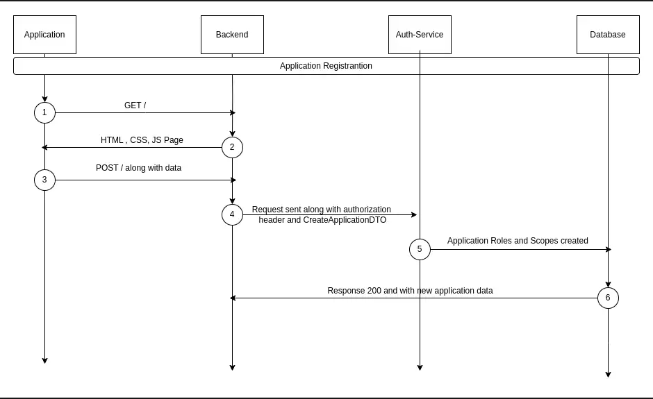

# Application 

## Overview
The ApplicationService is a crucial component of our NestJS application, responsible for managing application-related operations. It provides functionality for creating, updating, retrieving, and deleting applications, as well as managing their OAuth configurations and associated roles and scopes.


## Sequence Diagram



<!-- ## Endpoints -->

## Create Application  
### Request 
#### Creates a new application with random ID.
`POST /api/application`

#### Creates a new application with given ID.
`POST /api/application/:applicationId`

### Request Parameters
- applicationID : `string`

### Request Headers
- x-stencil-tenantid : `string` *Not Required*

- authorization : `string` *Required*

### Request Body
- applicationData : `{"active" : boolean, "name" : string, "scopes" : string[], "roles" : string[], "oauthConfiguration" : OauthConfiguration }`

### Response 

#### Response Codes

| Code | Description |
|------|-------------|
| 200  | The request was successful. The response will contain a JSON body. |
| 400  | The request was invalid and/or malformed. The response will contain an Errors JSON Object with the specific errors. This status will also be returned if a paid Auth Service license is required and is not present. |
| 401  | You did not supply a valid Authorization header. The header was omitted or your API key was not valid. The response will be empty. 
| 500  | There was an internal error. A stack trace is provided and logged in the Auth Service log files. The response will be empty. |

- **Sample cURL**:
  ```sh
  curl -X POST http://localhost:3000/application/<applicationId> \
  -H "Content-Type: application/json" \
  -H "Authorization: Basic <your_authorization_key>" \
  -H "X-Stencil-Tenantid: <your_tenant_id>" \
  -d '{
    "name": "<application_name>",
    "description": "<application_description>"
  }'

- **Sample HTTPie**:
  ```sh
  http POST http://localhost:3000/application/<applicationId> \
  Authorization:"Bearer <your_access_token>" \
  X-Stencil-Tenantid:"<your_tenant_id>" \
  data:='{
    "name": "<application_name>",
    "description": "<application_description>"
  }'


## Update An Application 
### Request 
#### Updates an existing Application
`PATCH /application/:applicationId`

#### Request Parameters
- applicationID : `String`

### Request Headers
- x-stencil-tenantid : `string` *Not Required*

- authorization : `string` *Required*

### Request Body
- applicationData : `{"active" ?: boolean, "name" ?: string,  "oauthConfiguration" ?: OauthConfiguration, "jwtConfiguration" : JwtConfiguration }`

### Response

#### Response Codes

| Code | Description |
|------|-------------|
| 200  | The request was successful. The response will contain a JSON body. |
| 400  | The request was invalid and/or malformed. The response will contain an Errors JSON Object with the specific errors. This status will also be returned if a paid Auth Service license is required and is not present. |
| 401  | You did not supply a valid Authorization header. The header was omitted or your API key was not valid. The response will be empty
| 404  | The object you are trying to update doesn't exist. The response will be empty. |
| 500  | There was an internal error. A stack trace is provided and logged in the Auth Service log files. The response will be empty. |

- **Sample cURL**:
  ```sh
  curl -X PATCH http://localhost:3000/application/<applicationId> \
  -H "Content-Type: application/json" \
  -H "Authorization: Basic <your_authorization_key>" \
  -H "X-Stencil-Tenantid: <your_tenant_id>" \
  -d '{
    "name": "<updated_application_name>",
    "description": "<updated_application_description>"
  }'


- **Sample HTTPie**:
  ```sh
  http PATCH http://localhost:3000/application/<applicationId> \
  Authorization:"Bearer <your_access_token>" \
  X-Stencil-Tenantid:"<your_tenant_id>" \
  data:='{
    "name": "<updated_application_name>",
    "description": "<updated_application_description>"
  }'

## Return Application 
### Request 
####  Return All Applications
`GET /application`
#### Return An Application 
`GET /application/:applicationId`

#### Request Headers 
- x-stencil-tenantid : `string` *not required*

- authorization : `string`

#### Request Parameters 
- applicationID : `string` *required to return an application*

### Response

#### Response Codes

| Code | Description |
|------|-------------|
| 200  | The request was successful. The response will contain a JSON body. |
| 400  | The request was invalid and/or malformed. The response will contain an Errors JSON Object with the specific errors. This status will also be returned if a paid Auth Service license is required and is not present. |
| 401  | You did not supply a valid Authorization header. The header was omitted or your API key was not valid. The response will be empty
| 404  | The object you are trying to update doesn't exist. The response will be empty. |
| 500  | There was an internal error. A stack trace is provided and logged in the Auth Service log files. The response will be empty. |

- **Sample cURL**:
  ```sh
  curl -X GET http://localhost:3000/application \
  -H "Authorization: Basic <your_authorization_key>" \
  -H "X-Stencil-Tenantid: <your_tenant_id>" \

- **Sample HTTPie**:
  ```sh
  http GET http://localhost:3000/application \
  Authorization:"Bearer <your_access_token>" \
  X-Stencil-Tenantid:"<your_tenant_id>" \


## Delete Application
### Request 
#### Deletes an application (soft or hard delete).
`DELETE /application/:applicationId`

#### Request Headers 
- x-stencil-tenantid : `string` *not required*

- authorization : `string`

#### Request Parameters 
- applicationID : `string`
- hardDelete : `boolean`

### Response

#### Response Codes

| Code | Description |
|------|-------------|
| 200  | The request was successful. The response will contain a JSON body. |
| 400  | The request was invalid and/or malformed. The response will contain an Errors JSON Object with the specific errors. This status will also be returned if a paid Auth Service license is required and is not present. |
| 401  | You did not supply a valid Authorization header. The header was omitted or your API key was not valid. The response will be empty
| 404  | The object you are trying to update doesn't exist. The response will be empty. |
| 500  | There was an internal error. A stack trace is provided and logged in the Auth Service log files. The response will be empty. |

- **Sample cURL**:
  ```sh
  curl -X DELETE http://localhost:3000/application/<applicationId> \
  -H "Authorization: Basic <your_authorization_key>" \
  -H "X-Stencil-Tenantid: <your_tenant_id>" \
  -d '{
    "hardDelete": <true_or_false>
  }'

- **Sample HTTPie**:
  ```sh
  http DELETE http://localhost:3000/application/<applicationId> \
  Authorization:"Bearer <your_access_token>" \
  X-Stencil-Tenantid:"<your_tenant_id>" \
  hardDelete=<true_or_false>

## Return Oauth Configuration
### Request 
##### Retrieves the OAuth configuration for a specific application.

`GET /application/:applicationId/oauth-configuration`

#### Request Headers 
- x-stencil-tenantid : `string` *not required*

- authorization : `string`

#### Request Parameters 
- applicationID : `string`

### Response

#### Response Codes

| Code | Description |
|------|-------------|
| 200  | The request was successful. The response will contain a JSON body. |
| 400  | The request was invalid and/or malformed. The response will contain an Errors JSON Object with the specific errors. This status will also be returned if a paid Auth Service license is required and is not present. |
| 401  | You did not supply a valid Authorization header. The header was omitted or your API key was not valid. The response will be empty
| 404  | The object you are trying to update doesn't exist. The response will be empty. |
| 500  | There was an internal error. A stack trace is provided and logged in the Auth Service log files. The response will be empty. |

- **Sample cURL**:
  ```sh
  curl -X GET http://localhost:3000/application/<applicationId>/oauth-configuration \
  -H "Authorization: Basic <your_authorization_key>" \
  -H "X-Stencil-Tenantid: <your_tenant_id>" \

- **Sample HTTPie**:
  ```sh
  http GET http://localhost:3000/application/<applicationId>/oauth-configuration \
  Authorization:"Bearer <your_access_token>" \
  X-Stencil-Tenantid:"<your_tenant_id>" \

<br>

# Application Scopes

## Overview
The ApplicationScopesService is a crucial component of our NestJS application, responsible for managing OAuth scopes for applications. It provides functionality for creating, updating, and deleting scopes associated with specific applications.

## Key Features
1. Scope CRUD operations
2. Tenant-based authorization
3. Application-specific scope management
4. Detailed error handling and logging

## Create Scope 

### Request
#### Create Scope with random id
`POST /application/:applicationId/scope`

#### Create Scope with given id
`POST /application/:applicationId/scope/:scopeId`

#### Request Parameters 
- data : `{"defaultConsentDetail": string, "defaultConsentMessage": string, "name" : string, "required" : boolean}`
- `applicationsId: string` - Application ID
- `scopeId: string` - Optional scope ID 

#### Request Headers 
- x-stencil-tenantid : `string` *not required*

- authorization : `string`

### Response

#### Response Codes

| Code | Description |
|------|-------------|
| 200  | The request was successful. The response will contain a JSON body. |
| 400  | The request was invalid and/or malformed. The response will contain an Errors JSON Object with the specific errors. This status will also be returned if a paid Auth Service license is required and is not present. |
| 401  | You did not supply a valid Authorization header. The header was omitted or your API key was not valid. The response will be empty
| 404  | The object you are trying to update doesn't exist. The response will be empty. |
| 500  | There was an internal error. A stack trace is provided and logged in the Auth Service log files. The response will be empty. |
    
- **Sample cURL**:
  ```sh
  curl -X POST http://localhost:3000/application/<applicationId>/scope \
  -H "Content-Type: application/json" \
  -H "Authorization: Basic <your_authorization_key>" \
  -H "X-Stencil-Tenantid: <your_tenant_id>" \
  -d '{
    "name": "<scope_name>",
    "description": "<scope_description>"
  }'

- **Sample HTTPie**:
  ```sh
  http POST http://localhost:3000/application/<applicationId>/scope \
  Authorization:"Bearer <your_access_token>" \
  X-Stencil-Tenantid:"<your_tenant_id>" \
  data:='{
    "name": "<scope_name>",
    "description": "<scope_description>"
  }'


## Update Scope
### Request 
#### Updates an existing scope for an application.
`PATCH /application/:applicationId/scope/:scopeId`

#### Request Parameters 
- `scopeId: string` - Scope ID 
- `applicationsId: string` - Application ID

#### Request Headers 
- x-stencil-tenantid : `string` *not required*

- authorization : `string`

#### Request Body 
- data : `{"defaultConsentDetail"?: string, "defaultConsentMessage" ?: string, "name" ?: string, "required" ?: boolean}`

### Response

#### Response Codes

| Code | Description |
|------|-------------|
| 200  | The request was successful. The response will contain a JSON body. |
| 400  | The request was invalid and/or malformed. The response will contain an Errors JSON Object with the specific errors. This status will also be returned if a paid Auth Service license is required and is not present. |
| 401  | You did not supply a valid Authorization header. The header was omitted or your API key was not valid. The response will be empty
| 404  | The object you are trying to update doesn't exist. The response will be empty. |
| 500  | There was an internal error. A stack trace is provided and logged in the Auth Service log files. The response will be empty. |

- **Sample cURL**:
  ```sh
  curl -X PATCH http://localhost:3000/application/<applicationId>/scope/<scopeId> \
  -H "Content-Type: application/json" \
  -H "Authorization: Basic <your_authorization_key>" \
  -H "X-Stencil-Tenantid: <your_tenant_id>" \
  -d '{
    "name": "<updated_scope_name>",
    "description": "<updated_scope_description>"
  }'

- **Sample HTTPie**:
  ```sh
  http PATCH http://localhost:3000/application/<applicationId>/scope/<scopeId> \
  Authorization:"Bearer <your_access_token>" \
  X-Stencil-Tenantid:"<your_tenant_id>" \
  data:='{
    "name": "<updated_scope_name>",
    "description": "<updated_scope_description>"
  }'


## Delete Scope
### Request 
#### Deletes a scope from an application.
`DELETE /application/:applicationId/scope/:scopeId`

#### Request Parameters 
- `scopeId: string` - Scope ID 
- `applicationsId: string` - Application ID

#### Request Headers 
- x-stencil-tenantid : `string` *not required*

- authorization : `string`

### Response

#### Response Codes

| Code | Description |
|------|-------------|
| 200  | The request was successful. The response will contain a JSON body. |
| 400  | The request was invalid and/or malformed. The response will contain an Errors JSON Object with the specific errors. This status will also be returned if a paid Auth Service license is required and is not present. |
| 401  | You did not supply a valid Authorization header. The header was omitted or your API key was not valid. The response will be empty
| 404  | The object you are trying to update doesn't exist. The response will be empty. |
| 500  | There was an internal error. A stack trace is provided and logged in the Auth Service log files. The response will be empty. |

- **Sample cURL**:
  ```sh
  curl -X DELETE http://localhost:3000/application/<applicationId>/scope/<scopeId> \
  -H "Authorization: Basic <your_authorization_key>" \
  -H "X-Stencil-Tenantid: <your_tenant_id>" \

- **Sample HTTPie**:
  ```sh
  http DELETE http://localhost:3000/application/<applicationId>/scope/<scopeId> \
  Authorization:"Bearer <your_access_token>" \
  X-Stencil-Tenantid:"<your_tenant_id>" \

<br>

# Application Roles 

## Overview
The ApplicationRolesService is a crucial component of our NestJS application, responsible for managing roles for applications. It provides functionality for creating, updating, and deleting roles associated with specific applications.

## Key Features
1. Role CRUD operations
2. Tenant-based authorization
3. Application-specific role management
4. Detailed error handling and logging

## Create Role 

### Request
#### Creates a new role with random ID. 
`POST /application/:applicationId/role`

#### Create Role with given id
`POST /application/:applicationId/role/:roleId`

#### Request Parameters 
- `applicationsId: string` - Application ID
- `roleId: string` - Role ID *required when creating role with given ID*

#### Request Headers 
- x-stencil-tenantid : `string` *not required*

- authorization : `string`

#### Request Body
- data : `{"description" : string, "isDefault" : boolean, "isSuperRole" : boolean, "name" : string}`

### Response

#### Response Codes

| Code | Description |
|------|-------------|
| 200  | The request was successful. The response will contain a JSON body. |
| 400  | The request was invalid and/or malformed. The response will contain an Errors JSON Object with the specific errors. This status will also be returned if a paid Auth Service license is required and is not present. |
| 401  | You did not supply a valid Authorization header. The header was omitted or your API key was not valid. The response will be empty
| 404  | The object you are trying to update doesn't exist. The response will be empty. |
| 500  | There was an internal error. A stack trace is provided and logged in the Auth Service log files. The response will be empty. |


- **Sample cURL**:
  ```sh
  curl -X POST http://localhost:3000/application/<applicationId>/role \
  -H "Content-Type: application/json" \
  -H "Authorization: Basic <your_authorization_key>" \
  -H "X-Stencil-Tenantid: <your_tenant_id>" \
  -d '{
    "name": "<role_name>",
    "description": "<role_description>"
  }'

- **Sample HTTPie**:
  ```sh
  http POST http://localhost:3000/application/<applicationId>/role \
  Authorization:"Bearer <your_access_token>" \
  X-Stencil-Tenantid:"<your_tenant_id>" \
  data:='{
    "name": "<role_name>",
    "description": "<role_description>"
  }'

## Update Role
### Request 
####  Updates an existing role for an application.
`PATCH /application/:applicationId/role/:roleId`

#### Request Parameters 
- `id: string` - Application ID
- `roleId: string` - Role ID

#### Request Headers 
- x-stencil-tenantid : `string` *not required*

- authorization : `string`

#### Request Body
- `data: UpdateRoleDto` - Updated role data

### Response

#### Response Codes

| Code | Description |
|------|-------------|
| 200  | The request was successful. The response will contain a JSON body. |
| 400  | The request was invalid and/or malformed. The response will contain an Errors JSON Object with the specific errors. This status will also be returned if a paid Auth Service license is required and is not present. |
| 401  | You did not supply a valid Authorization header. The header was omitted or your API key was not valid. The response will be empty
| 404  | The object you are trying to update doesn't exist. The response will be empty. |
| 500  | There was an internal error. A stack trace is provided and logged in the Auth Service log files. The response will be empty. |


- **Sample cURL**:
  ```sh
  curl -X PATCH http://localhost:3000/application/<applicationId>/role/<roleId> \
  -H "Authorization: Basic <your_authorization_key>" \
  -H "X-Stencil-Tenantid: <your_tenant_id>" \
  -d '{
    "name": "<updated_role_name>",
    "description": "<updated_role_description>"
  }'

- **Sample HTTPie**:
  ```sh
  http PATCH http://localhost:3000/application/<applicationId>/role/<roleId> \
  Authorization:"Bearer <your_access_token>" \
  X-Stencil-Tenantid:"<your_tenant_id>" \
  data:='{
    "name": "<updated_role_name>",
    "description": "<updated_role_description>"
  }'


## Delete Role
### Request 
#### Deletes a role from an application.
`DELETE /application/:applicationId/role/:roleId`    

#### Request Parameters 
- `id: string` - Application ID
- `roleId: string` - Role ID

#### Request Headers 
- x-stencil-tenantid : `string` *not required*

- authorization : `string`

### Response

#### Response Codes

| Code | Description |
|------|-------------|
| 200  | The request was successful. The response will contain a JSON body. |
| 400  | The request was invalid and/or malformed. The response will contain an Errors JSON Object with the specific errors. This status will also be returned if a paid Auth Service license is required and is not present. |
| 401  | You did not supply a valid Authorization header. The header was omitted or your API key was not valid. The response will be empty
| 404  | The object you are trying to update doesn't exist. The response will be empty. |
| 500  | There was an internal error. A stack trace is provided and logged in the Auth Service log files. The response will be empty. |


- **Sample cURL**:
  ```sh
  curl -X DELETE http://localhost:3000/application/<applicationId>/role/<roleId> \
  -H "Authorization: Basic <your_authorization_key>" \
  -H "X-Stencil-Tenantid: <your_tenant_id>" \

- **Sample HTTPie**:
  ```sh
  http DELETE http://localhost:3000/application/<applicationId>/role/<roleId> \
  Authorization:"Bearer <your_access_token>" \
  X-Stencil-Tenantid:"<your_tenant_id>" \

## Error Handling
The service implements comprehensive error handling, throwing appropriate exceptions:
- BadRequestException
- UnauthorizedException
- InternalServerErrorException

## Authorization
All endpoints are protected by authorization headers which requires authorization and x-stencil-tenanid values to be passed in headers, which are verified using the `HeaderAuthService`.

## Usage Notes
1. Ensure that the necessary environment variables and configurations are set up for Prisma and other dependent services.
2. The service expects certain headers for authorization, including `x-stencil-tenantid` for tenant-scoped operations.
3. When creating or updating roles, make sure to provide all required fields in the DTO objects.
4. The service interacts closely with the database using Prisma ORM. Ensure your database schema matches the expected structure for applications and roles.
5. The `isDefault` and `isSuperRole` flags in the role data can be used to designate special roles within an application.
