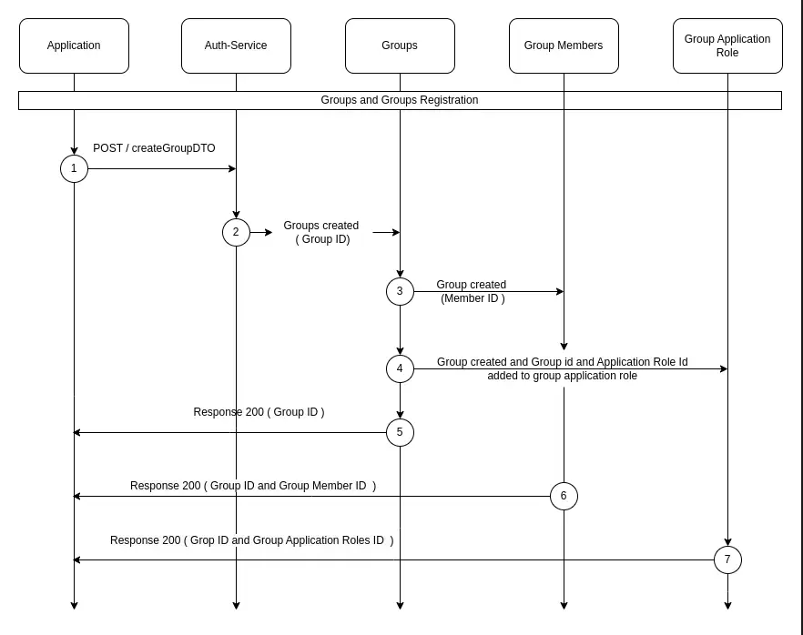

# Group API
- A Group is a named object that optionally contains one to many Application Roles.
- This service provides endpoints for managing groups within a multi-application system. It uses NestJS and Prisma for database operations.
- A Group can have roles from different applications as long as those applications are in the same tenant.

## Sequence Diagram



## Create Group 
### Request 
#### Create Group with random Id 
`POST /group`

#### Create Group with given Id 
`POST /group/:id`

#### Request Headers 
- authorization : `string`

#### Request Body 
- data : `{"roleIDs" : string[], "name" : string}`

#### Request Parameter
- id : `string`

### Response

#### Response Codes

| Code | Description |
|------|-------------|
| 200  | The request was successful. The response will contain a JSON body. |
| 400  | The request was invalid and/or malformed. The response will contain an Errors JSON Object with the specific errors. This status will also be returned if a paid Auth Service license is required and is not present. |
| 401  | You did not supply a valid Authorization header. The header was omitted or your API key was not valid. The response will be empty
| 404  | The object you are trying to update doesn't exist. The response will be empty. |
| 500  | There was an internal error. A stack trace is provided and logged in the Auth Service log files. The response will be empty. |

- **Sample cURL**:
  ```sh
  curl -X POST http://localhost:3000/group \
    -H "Content-Type: application/json" \
    -H "Authorization: Basic <your_authorization_key>" \
    -d '{
      "name": "<group_name>",
      "tenantId": "<tenant_id>",
      "roleIDs": ["<role_id1>", "<role_id2>"]
    }'

- **Sample HTTPie**:
  ```sh
  http POST http://localhost:3000/group \
  Authorization:"Basic <your_authorization_key>"
  name="<group_name>" \
  tenantId="<tenant_id>" \
  roleIDs:='["<role_id1>", "<role_id2>"]'

## Retrieve All Groups
### Request 
#### Retrieve all of the configured Groups.
`GET /group`

#### Retrieve Group by ID
`GET /group/:id`

#### Request Headers 
- authorization : `string`

#### Request Parameter
- id : `string` *required when retreival needed for a particular group*

### Response

#### Response Codes

| Code | Description |
|------|-------------|
| 200  | The request was successful. The response will contain a JSON body. |
| 400  | The request was invalid and/or malformed. The response will contain an Errors JSON Object with the specific errors. This status will also be returned if a paid Auth Service license is required and is not present. |
| 401  | You did not supply a valid Authorization header. The header was omitted or your API key was not valid. The response will be empty
| 404  | The object you are trying to update doesn't exist. The response will be empty. |
| 500  | There was an internal error. A stack trace is provided and logged in the Auth Service log files. The response will be empty. |

- **Sample cURL**:
  ```sh
  curl -X GET http://localhost:3000/group \
  -H "Authorization: Bearer <your_access_token>"


- **Sample HTTPie**:
  ```sh
  http GET http://localhost:3000/group \
  Authorization:"Bearer <your_access_token>"


## Update Group
### Request 
#### Update an existing Group
`PUT /group/:id`
  
#### Request Headers 
- authorization : `string`

#### Request Body 
- name : `string`,
- roleIDs : `string[]`

#### Request Parameter
- id : `string` 
- 
### Response

#### Response Codes

| Code | Description |
|------|-------------|
| 200  | The request was successful. The response will contain a JSON body. |
| 400  | The request was invalid and/or malformed. The response will contain an Errors JSON Object with the specific errors. This status will also be returned if a paid Auth Service license is required and is not present. |
| 401  | You did not supply a valid Authorization header. The header was omitted or your API key was not valid. The response will be empty
| 404  | The object you are trying to update doesn't exist. The response will be empty. |
| 500  | There was an internal error. A stack trace is provided and logged in the Auth Service log files. The response will be empty. |

- **Sample cURL**:
  ```sh
  curl -X PUT http://localhost:3000/group/<id> \
  -H "Content-Type: application/json" \
  -H "Authorization: Basic <your_authorization_key>" \
  -d '{
    "name": "<updated_group_name>",
    "roleIDs": ["<updated_role_id1>", "<updated_role_id2>"]
  }'

- **Sample HTTPie**:
  ```sh
  http PUT http://localhost:3000/group/<id> \
  Authorization:"Basic <your_authorization_key>"
  name="<updated_group_name>" \
  roleIDs:='["<updated_role_id1>", "<updated_role_id2>"]'


## Delete Group
### Request 
#### Delete a Group permanently
`DELETE /group/:id`

#### Request Headers 
- authorization : `string`

#### Request Parameter
- id : `string` 
- 
### Response

#### Response Codes

| Code | Description |
|------|-------------|
| 200  | The request was successful. The response will contain a JSON body. |
| 400  | The request was invalid and/or malformed. The response will contain an Errors JSON Object with the specific errors. This status will also be returned if a paid Auth Service license is required and is not present. |
| 401  | You did not supply a valid Authorization header. The header was omitted or your API key was not valid. The response will be empty
| 404  | The object you are trying to update doesn't exist. The response will be empty. |
| 500  | There was an internal error. A stack trace is provided and logged in the Auth Service log files. The response will be empty. |
- **Sample cURL**:
  ```sh
  curl -X DELETE http://localhost:3000/group/<id> \
  -H "Authorization: Bearer <your_access_token>"


- **Sample HTTPie**:
  ```sh
  http DELETE http://localhost:3000/group/<id> \
  Authorization:"Bearer <your_access_token>"


## Authorization
All endpoints are protected by authorization headers which requires authorization and x-stencil-tenanid values to be passed in headers, which are verified using the `HeaderAuthService`.

## Error Handling
The service includes comprehensive error handling, throwing appropriate exceptions for various scenarios such as unauthorized access, bad requests, or when required data is missing.

## Response Format
All endpoints return a standardized `ResponseDto` object containing:
- `success`: Boolean indicating operation success
- `message`: Descriptive message about the operation result
- `data`: The requested or manipulated data (when applicable)

<br>

# Group User API

This service manages the relationship between users and groups within a multi-application system. It uses NestJS and Prisma for database operations.

## Endpoints
> If the authorization key provided in Authorization header is tenant scoped, then an additional header `X-Stencil-Tenantid` is required to specify the tenant to be used. `-H "X-Stencil-Tenantid: <your_tenant_id>"` or `X-Stencil-Tenantid: <your_tenant_id>`

## Add User to Group
### Request 
#### Add Users to a Group.
`POST /group/member`

#### Request Headers 
- authorization : `string`

#### Request Body 
- members : `{groupIDs : string[], userIDs : string[]}`

### Response

#### Response Codes

| Code | Description |
|------|-------------|
| 200  | The request was successful. The response will contain a JSON body. |
| 400  | The request was invalid and/or malformed. The response will contain an Errors JSON Object with the specific errors. This status will also be returned if a paid Auth Service license is required and is not present. |
| 401  | You did not supply a valid Authorization header. The header was omitted or your API key was not valid. The response will be empty
| 404  | The object you are trying to update doesn't exist. The response will be empty. |
| 500  | There was an internal error. A stack trace is provided and logged in the Auth Service log files. The response will be empty. |

- **Sample cURL**:
  ```sh
  curl -X POST http://localhost:3000/group/member \
  -H "Content-Type: application/json" \
  -H "Authorization: Basic <your_authorization_key>" \
  -d '{
    "members": [
      {
        "groupId": "<group_id>",
        "userIds": ["<user_id1>", "<user_id2>"]
      }
    ]
  }'
- **Sample HTTPie**:
  ```sh
  http POST http://localhost:3000/group/member \
  Authorization:"Basic <your_authorization_key>"
  members:='[
    {
      "groupId": "<group_id>",
      "userIds": ["<user_id1>", "<user_id2>"]
    }
  ]'


## Update User in Group
### Request 
#### Updates user memberships in groups
`PUT /group/member`

#### Request Headers 
- authorization : `string`

#### Request Body 
- members : `{groupIDs : string[], userIDs : string[]}`

### Response

#### Response Codes

| Code | Description |
|------|-------------|
| 200  | The request was successful. The response will contain a JSON body. |
| 400  | The request was invalid and/or malformed. The response will contain an Errors JSON Object with the specific errors. This status will also be returned if a paid Auth Service license is required and is not present. |
| 401  | You did not supply a valid Authorization header. The header was omitted or your API key was not valid. The response will be empty
| 404  | The object you are trying to update doesn't exist. The response will be empty. |
| 500  | There was an internal error. A stack trace is provided and logged in the Auth Service log files. The response will be empty. |

- **Sample cURL**:
  ```sh
  curl -X PUT http://localhost:3000/group/member \
  -H "Content-Type: application/json" \
  -H "Authorization: Basic <your_authorization_key>" \
  -d '{
    "members": [
      {
        "groupId": "<group_id>",
        "userIds": ["<updated_user_id1>", "<updated_user_id2>"]
      }
    ]
  }'


- **Sample HTTPie**:
  ```sh
  http PUT http://localhost:3000/group/member \
  Authorization:"Basic <your_authorization_key>"
  members:='[
    {
      "groupId": "<group_id>",
      "userIds": ["<updated_user_id1>", "<updated_user_id2>"]
    }
  ]'


## Delete Member 
### Request 
####  Delete Member by ID
`DELETE /group/member/:id`

#### Delete Member by User ID and Group ID
`DELETE /group/member`

#### Delete All Users from Group
`DELETE /group/member`

#### Delete Multiple Members
`DELETE /group/member`

#### Request Headers 
- authorization : `string`

#### Request Parameter 
- id : `string` *required when group is to be deleted through ID*
- `userId`: The ID of the user && `gpId`: The ID of the group *required when group is to be deleted through userID and GroupID*
- `gpId`: The ID of the group *required when group is to be deleted thorugh group ID*

#### Request Body 
- members : `{membership : string[]}` *required when multiple members of a gp to be deleted*

### Response

#### Response Codes

| Code | Description |
|------|-------------|
| 200  | The request was successful. The response will contain a JSON body. |
| 400  | The request was invalid and/or malformed. The response will contain an Errors JSON Object with the specific errors. This status will also be returned if a paid Auth Service license is required and is not present. |
| 401  | You did not supply a valid Authorization header. The header was omitted or your API key was not valid. The response will be empty
| 404  | The object you are trying to update doesn't exist. The response will be empty. |
| 500  | There was an internal error. A stack trace is provided and logged in the Auth Service log files. The response will be empty. |

- **Sample cURL**:
  ```sh
  curl -X DELETE http://localhost:3000/group/member/<id> \
  -H "Authorization: Bearer <your-token>" \
  -H "x-stencil-tenanid: <your-tenant-id>"


- **Sample HTTPie**:
  ```sh
  http DELETE http://localhost:3000/group/member/<id> \
  Authorization:"Bearer <your-token>" \
  x-stencil-tenanid:<your-tenant-id>

## Authorization
All endpoints are protected by authorization headers which requires authorization and x-stencil-tenanid values to be passed in headers, which are verified using the `HeaderAuthService`.

## Error Handling
The service includes comprehensive error handling, throwing appropriate exceptions for various scenarios such as unauthorized access, bad requests, or when required data is missing.

## Response Format
All endpoints return a standardized `ResponseDto` object containing:
- `success`: Boolean indicating operation success
- `message`: Descriptive message about the operation result
- `data`: The requested or manipulated data (when applicable)

