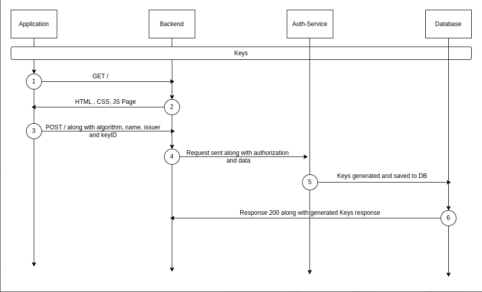

# Key API
This API provides endpoints for managing cryptographic keys. Cryptographic keys are used in signing and verifying JWTs and verifying responses for third party identity providers

> Only a `tenant scoped` authorization key can access these routes

## Key Types
The service supports generating three types of keys:
- RSA keys (RS256, RS384, RS512)
- Elliptic Curve keys (ES256, ES384, ES512)

Each key type is stored in the database with its relevant information, including public and private keys where applicable.

## Sequence Diagram



## Retrieve Keys

### Request
####  Retrieve All Keys
`GET /key`
#### Retrieve Unique Key
`GET /key/:id`

#### Request Headers 
- authorization : `string`

#### Request Parameters
- keyID : `string` *required when returning a key*

### Response

#### Response Codes

| Code | Description |
|------|-------------|
| 200  | The request was successful. The response will contain a JSON body. |
| 400  | The request was invalid and/or malformed. The response will contain an Errors JSON Object with the specific errors. This status will also be returned if a paid Auth Service license is required and is not present. |
| 401  | You did not supply a valid Authorization header. The header was omitted or your API key was not valid. The response will be empty
| 404  | The object you are trying to update doesn't exist. The response will be empty. |
| 500  | There was an internal error. A stack trace is provided and logged in the Auth Service log files. The response will be empty. |

- **Sample cURL**:
  ```sh
  curl -X GET http://localhost:3000/key \
       -H "Authorization: Basic <your_authorization_key>" \


- **Sample HTTPie**:
  ```sh
  http GET http://localhost:3000/key \
  Authorization:"Basic <your_authorization_key>"


## Update Key
### Request 
#### To update an existing key 
`PUT /key/:id`

#### Request Headers 
- authorization : `string`

#### Request Parameters
- `keyID`: The unique id of the key.
- `name`: The new name for the key.

### Response

#### Response Codes

| Code | Description |
|------|-------------|
| 200  | The request was successful. The response will contain a JSON body. |
| 400  | The request was invalid and/or malformed. The response will contain an Errors JSON Object with the specific errors. This status will also be returned if a paid Auth Service license is required and is not present. |
| 401  | You did not supply a valid Authorization header. The header was omitted or your API key was not valid. The response will be empty
| 404  | The object you are trying to update doesn't exist. The response will be empty. |
| 500  | There was an internal error. A stack trace is provided and logged in the Auth Service log files. The response will be empty. |


- **Sample cURL**:
  ```sh
  curl -X PUT http://localhost:3000/key/unique_key_id \
  -H "Authorization: Basic <your_authorization_key>" \
  -H "Content-Type: application/json" \
  -d '{
    "name": "new_key_name"
  }'

- **Sample HTTPie**:
  ```sh
  http PUT http://localhost:3000/key/unique_key_id \
  Authorization:"Basic <your_authorization_key>"
  name="new_key_name"


## Delete Key
### Request 
####  Deletes a specific key by its UUID.
`DELETE /key/:id`

#### Request Headers 
- authorization : `string`

#### Request Parameters
- `keyID`: The unique id of the key.

### Response

#### Response Codes

| Code | Description |
|------|-------------|
| 200  | The request was successful. The response will contain a JSON body. |
| 400  | The request was invalid and/or malformed. The response will contain an Errors JSON Object with the specific errors. This status will also be returned if a paid Auth Service license is required and is not present. |
| 401  | You did not supply a valid Authorization header. The header was omitted or your API key was not valid. The response will be empty
| 404  | The object you are trying to update doesn't exist. The response will be empty. |
| 500  | There was an internal error. A stack trace is provided and logged in the Auth Service log files. The response will be empty. |


- **Sample cURL**:
  ```sh
  curl -X DELETE http://localhost:3000/key/unique_key_id \
       -H "Authorization: Basic <your_authorization_key>" \

- **Sample HTTPie**:
  ```sh
  http DELETE http://localhost:3000/key/unique_key_id \
  Authorization:"Basic <your_authorization_key>"

## Generate Key 
### Request 
#### Generate Key with random id
`POST /key/generate`
#### Generate Key with given id
`POST /key/generate:id`

#### Request Headers 
- authorization : `string`

#### Request Parameters
- `keyID`: The unique id of the key. *required when key generated with given id*

#### Request Body 
- `algorithm`: The algorithm to use (RS or ES)
- `name`: The name of the key
- `issuer`: The issuer of the key

### Response

#### Response Codes

| Code | Description |
|------|-------------|
| 200  | The request was successful. The response will contain a JSON body. |
| 400  | The request was invalid and/or malformed. The response will contain an Errors JSON Object with the specific errors. This status will also be returned if a paid Auth Service license is required and is not present. |
| 401  | You did not supply a valid Authorization header. The header was omitted or your API key was not valid. The response will be empty
| 404  | The object you are trying to update doesn't exist. The response will be empty. |
| 500  | There was an internal error. A stack trace is provided and logged in the Auth Service log files. The response will be empty. |

- **Sample cURL**:
  ```sh
  curl -X POST http://localhost:3000/key/generate \
  -H "Authorization: Basic <your_authorization_key>" \
  -H "Content-Type: application/json" \
  -d '{
    "uuid": "random_key_id",
    "algorithm": "RS256",
    "name": "new_key",
    "issuer": "example_issuer"
  }'

- **Sample HTTPie**:
  ```sh
  http POST http://localhost:3000/key/generate \
  Authorization:"Basic <your_authorization_key>"
  uuid="random_key_id" \
  algorithm="RS256" \
  name="new_key" \
  issuer="example_issuer"


## Authorization
All endpoints are protected by authorization headers which requires authorization and x-stencil-tenanid values to be passed in headers, which are verified using the `HeaderAuthService`.

## Error Handling
The service includes comprehensive error handling, throwing appropriate HTTP exceptions for various scenarios such as unauthorized access, bad requests, or internal server errors.

## Response Format
All endpoints return a standardized `ResponseDto` object containing:
- `success`: Boolean indicating operation success
- `message`: Descriptive message about the operation result
- `data`: The requested or manipulated data (when applicable)
