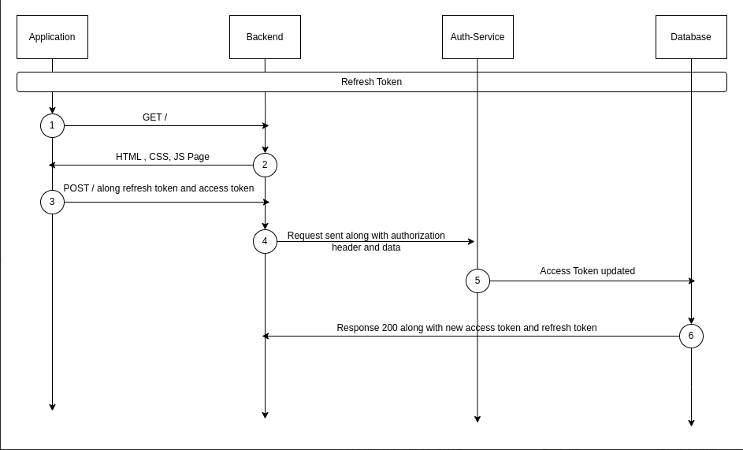

# Refresh Token API
Refresh token is a token assigned to user while registration, and is used to refresh  access tokens.

> All the endpoints except `jwt/refresh` requires an additional header `X-Stencil-Tenantid` to specify the tenant which is refrred

## Key Features
- JWT-based token refresh mechanism
- Comprehensive token retrieval and deletion options
- Secure token handling and validation

## Sequence Diagram



## Refresh Token

### Request
#### Refreshes an access token using a refresh token.
`POST /jwt/refresh`
- **Description**: 
- **Parameters**: 
  - Refresh token and access token (either through cookie or request body)

#### Request Headers 
- authorization : `string`

#### Request Parameters
- Refresh Token : `string`
- Access Token : `string`

### Response

#### Response Codes

| Code | Description |
|------|-------------|
| 200  | The request was successful. The response will contain a JSON body. |
| 400  | The request was invalid and/or malformed. The response will contain an Errors JSON Object with the specific errors. This status will also be returned if a paid Auth Service license is required and is not present. |
| 401  | You did not supply a valid Authorization header. The header was omitted or your API key was not valid. The response will be empty
| 404  | The object you are trying to update doesn't exist. The response will be empty. |
| 500  | There was an internal error. A stack trace is provided and logged in the Auth Service log files. The response will be empty. |

- **Sample HTTPie**:
  ```sh
  http POST http://localhost:3000/jwt/refresh \
  refreshToken="<your_refresh_token>"
- **Sample cURL**:
  ```sh
  curl -X POST http://localhost:3000/jwt/refresh \
    -H "Content-Type: application/json" \
    -d '{
      "refreshToken": "<your_refresh_token>"
    }'

## Retrieve Refresh Token 
### Request 
#### Retrieve Refresh Token by ID
`POST /jwt/refresh/:id`

#### Retrieve Refresh Tokens by User ID
`POST /jwt/refresh`

#### Request Headers 
- authorization : `string`

#### Request Parameters
- `id : string`
- `userID : string`

### Response

#### Response Codes

| Code | Description |
|------|-------------|
| 200  | The request was successful. The response will contain a JSON body. |
| 400  | The request was invalid and/or malformed. The response will contain an Errors JSON Object with the specific errors. This status will also be returned if a paid Auth Service license is required and is not present. |
| 401  | You did not supply a valid Authorization header. The header was omitted or your API key was not valid. The response will be empty
| 404  | The object you are trying to update doesn't exist. The response will be empty. |
| 500  | There was an internal error. A stack trace is provided and logged in the Auth Service log files. The response will be empty. |

- **Sample HTTPie**:
  ```sh
  http POST http://localhost:3000/jwt/refresh/<id> \
  Authorization:"Basic <your_authorization_key>"


- **Sample cURL**:
  ```sh
  curl -X POST http://localhost:3000/jwt/refresh/<id> \
  -H "Content-Type: application/json" \
  -H "Authorization: Basic <your_authorization_key>" \

## Delelte Refresh Tokens 
### Request 
#### Delete Refresh Tokens by Application ID
- `POST /jwt/refresh/:tokenId`

#### Delete Refresh Tokens by User ID
- `POST /jwt/refresh`

#### Delete Refresh Tokens by User and Application ID
- `POST /jwt/refresh`

#### Delete Refresh Token by Token ID
- `POST /jwt/refresh`

#### Delete Refresh Token by Token String
- `POST /jwt/refresh`

#### Request Headers 
- authorization : `string`

#### Request Parameters
- `applicationsId`: Application ID *required when delete all tokens associated with an application ID*
- `userId`: User ID *required when delete all tokens associated with a user ID*
- `userId`: User ID && - `applicationsId`: Application ID *required when delete a tokens associated with a user ID and a application ID*
- `tokenId`: id *required to delete through a specific refresh token by its ID*
- `TokenString`: String *required when to delete via specific token string* 

### Response

#### Response Codes

| Code | Description |
|------|-------------|
| 200  | The request was successful. The response will contain a JSON body. |
| 400  | The request was invalid and/or malformed. The response will contain an Errors JSON Object with the specific errors. This status will also be returned if a paid Auth Service license is required and is not present. |
| 401  | You did not supply a valid Authorization header. The header was omitted or your API key was not valid. The response will be empty
| 404  | The object you are trying to update doesn't exist. The response will be empty. |
| 500  | There was an internal error. A stack trace is provided and logged in the Auth Service log files. The response will be empty. |

- **Sample HTTPie**:
  ```sh
  http POST http://localhost:3000/jwt/refresh/<tokenId> \
  Authorization:"Basic <your_authorization_key>" \
  applicationsId="<application_id>"

- **Sample cURL**:
  ```sh
  curl -X POST http://localhost:3000/jwt/refresh/<tokenId> \
  -H "Content-Type: application/json" \
  -H "Authorization: Basic <your_authorization_key>" \
  -d '{
    "applicationsId": "<application_id>"
  }'


## Authorization
All endpoints are protected by authorization headers which requires authorization and x-stencil-tenanid values to be passed in headers, which are verified using the `HeaderAuthService`.

## Error Handling
The service includes comprehensive error handling, throwing appropriate exceptions for various scenarios such as:
- Unauthorized access
- Bad requests (missing or invalid data)
- Internal server errors

## Response Format
All endpoints return a standardized response object containing:
- `success`: Boolean indicating operation success
- `message`: Descriptive message about the operation result
- `data`: The requested or manipulated data (when applicable)

