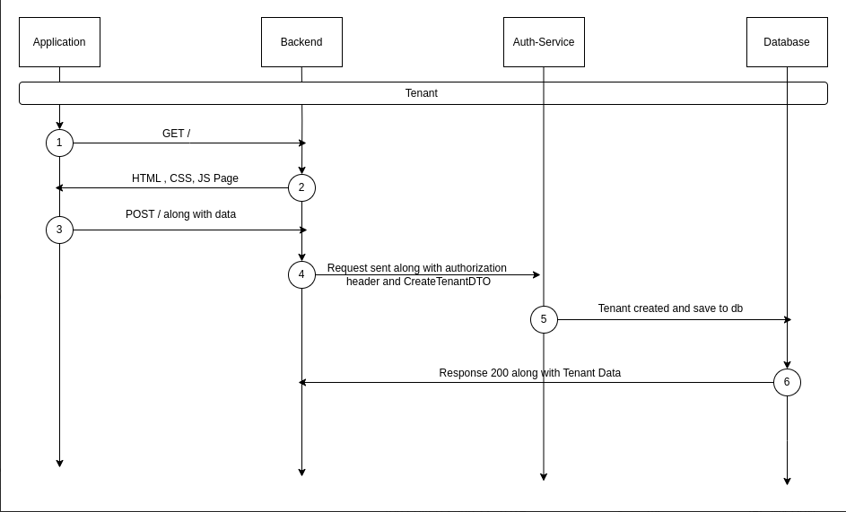

# Tenant API

## Overview
- A Tenant is a named object that represents a discrete namespace for Users, Applications and Groups. A user is unique by email address.

> `GET /tenant, DEL /tenant, PATCH /tenant` requires `X-Stencil-Tenanid` as a header also.
> `POST /tenant` can only be accessed by a `tenant-scoped` authorization key

## Sequence Diagram



## Create a Tenant 
### Request 
#### Create a Tenant with random id 
`POST /tenant`

#### Create a Tenant with given id 
`POST /tenant/:id`

#### Request Headers 
- authorization : `string`

#### Request Parameters
- id: `string`

#### Request Body 
- data : `{"name" : string, "jwtConfiguration" : JwtConfiguration}`

### Response

#### Response Codes

| Code | Description |
|------|-------------|
| 200  | The request was successful. The response will contain a JSON body. |
| 400  | The request was invalid and/or malformed. The response will contain an Errors JSON Object with the specific errors. This status will also be returned if a paid Auth Service license is required and is not present. |
| 401  | You did not supply a valid Authorization header. The header was omitted or your API key was not valid. The response will be empty
| 404  | The object you are trying to update doesn't exist. The response will be empty. |
| 500  | There was an internal error. A stack trace is provided and logged in the Auth Service log files. The response will be empty. |

- **Sample HTTPie**:
  ```sh
  http POST http://localhost:3000/tenant \
  Authorization:"Bearer <your_access_token>" \
  id="<tenant_id>" \
  data:='{
    "name": "<tenant_name>",
    "description": "<tenant_description>"
  }'

- **Sample cURL**:
  ```sh
  curl -X POST http://localhost:3000/tenant \
    -H "Content-Type: application/json" \
    -H "Authorization: Bearer <your_access_token>" \
    -d '{
      "id": "<tenant_id>",
      "data": {
        "name": "<tenant_name>",
        "description": "<tenant_description>"
      }
    }'

## Update a Tenant 
### Request 
#### Updates an existing tenant.
`PATCH /tenant/:id`

#### Request Headers 
- authorization : `string`

#### Request Parameters
- id: `string`

#### Request Body 
- data : `{"name" ?: string, "jwtConfiguration" ?: JwtConfiguration, "data" ?: string | JSON }`

### Response

#### Response Codes

| Code | Description |
|------|-------------|
| 200  | The request was successful. The response will contain a JSON body. |
| 400  | The request was invalid and/or malformed. The response will contain an Errors JSON Object with the specific errors. This status will also be returned if a paid Auth Service license is required and is not present. |
| 401  | You did not supply a valid Authorization header. The header was omitted or your API key was not valid. The response will be empty
| 404  | The object you are trying to update doesn't exist. The response will be empty. |
| 500  | There was an internal error. A stack trace is provided and logged in the Auth Service log files. The response will be empty. |

- **Sample HTTPie**:
  ```sh
  http PATCH http://localhost:3000/tenant/<id> \
  Authorization:"Bearer <your_access_token>" \
  data:='{
    "name": "<updated_name>",
    "description": "<updated_description>"
  }'

- **Sample cURL**:
  ```sh
  curl -X PATCH http://localhost:3000/tenant/<id> \
  -H "Content-Type: application/json" \
  -H "Authorization: Bearer <your_access_token>" \
  -d '{
    "data": {
      "name": "<updated_name>",
      "description": "<updated_description>"
    }
  }'


## Delete a Tenant 
### Request 
#### Deletes an existing tenant. 
`DELETE /tenant/:id`

#### Request Headers 
- authorization : `string`

#### Request Parameters
- id: `string`

### Response

#### Response Codes

| Code | Description |
|------|-------------|
| 200  | The request was successful. The response will contain a JSON body. |
| 400  | The request was invalid and/or malformed. The response will contain an Errors JSON Object with the specific errors. This status will also be returned if a paid Auth Service license is required and is not present. |
| 401  | You did not supply a valid Authorization header. The header was omitted or your API key was not valid. The response will be empty
| 404  | The object you are trying to update doesn't exist. The response will be empty. |
| 500  | There was an internal error. A stack trace is provided and logged in the Auth Service log files. The response will be empty. |

- **Sample HTTPie**:
  ```sh
  http DELETE http://localhost:3000/tenant/<id> \
  Authorization:"Bearer <your_access_token>"

- **Sample cURL**:
  ```sh
  curl -X DELETE http://localhost:3000/tenant/<id> \
  -H "Authorization: Bearer <your_access_token>"


## Return Tenant 
### Request 
#### Retrieves a tenant by ID.
`GET /tenant/:id`

#### Return all Tenants
`GET /tenant`
  
#### Request Headers 
- authorization : `string`

#### Request Parameters
- id: `string`

### Response

#### Response Codes

| Code | Description |
|------|-------------|
| 200  | The request was successful. The response will contain a JSON body. |
| 400  | The request was invalid and/or malformed. The response will contain an Errors JSON Object with the specific errors. This status will also be returned if a paid Auth Service license is required and is not present. |
| 401  | You did not supply a valid Authorization header. The header was omitted or your API key was not valid. The response will be empty
| 404  | The object you are trying to update doesn't exist. The response will be empty. |
| 500  | There was an internal error. A stack trace is provided and logged in the Auth Service log files. The response will be empty. |
- **Sample HTTPie**:
  ```sh
  http GET http://localhost:3000/tenant/<id> \
  Authorization:"Bearer <your_access_token>"

- **Sample cURL**:
  ```sh
  curl -X GET http://localhost:3000/tenant/<id> \
  -H "Authorization: Bearer <your_access_token>"


## Authorization
All endpoints are protected by authorization headers which requires authorization and x-stencil-tenanid values to be passed in headers, which are verified using the `HeaderAuthService`.

## Error Handling

The service uses standard NestJS exceptions to handle errors:
- `UnauthorizedException`: Thrown when authorization fails.
- `BadRequestException`: Thrown when required parameters are missing or invalid.
- `InternalServerErrorException`: Thrown when a server error occurs during an operation.

## Response Format
All endpoints return a standardized response object containing:
- `success`: Boolean indicating operation success
- `message`: Descriptive message about the operation result
- `data`: The requested or manipulated data (when applicable)
